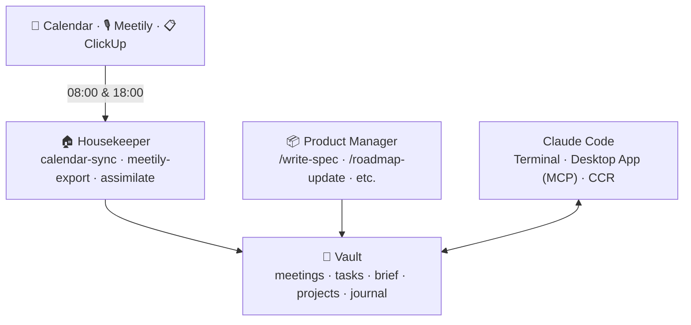
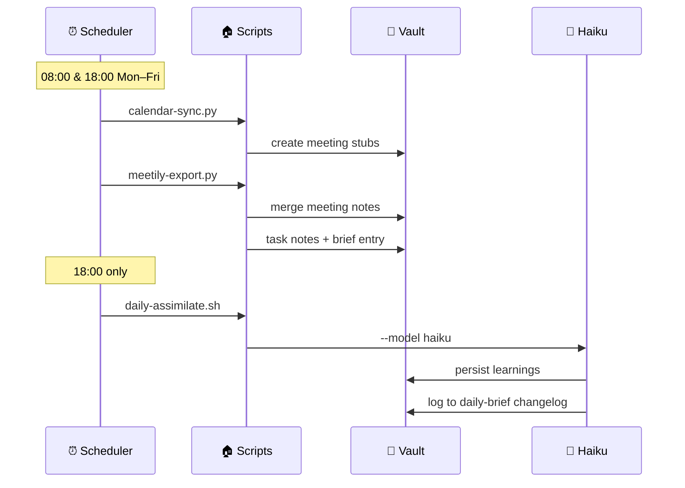
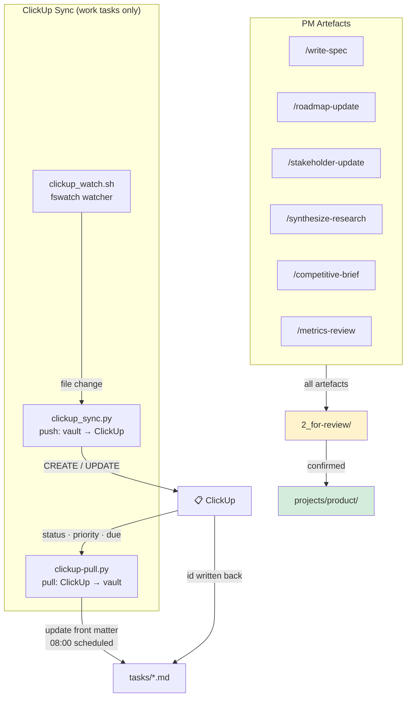
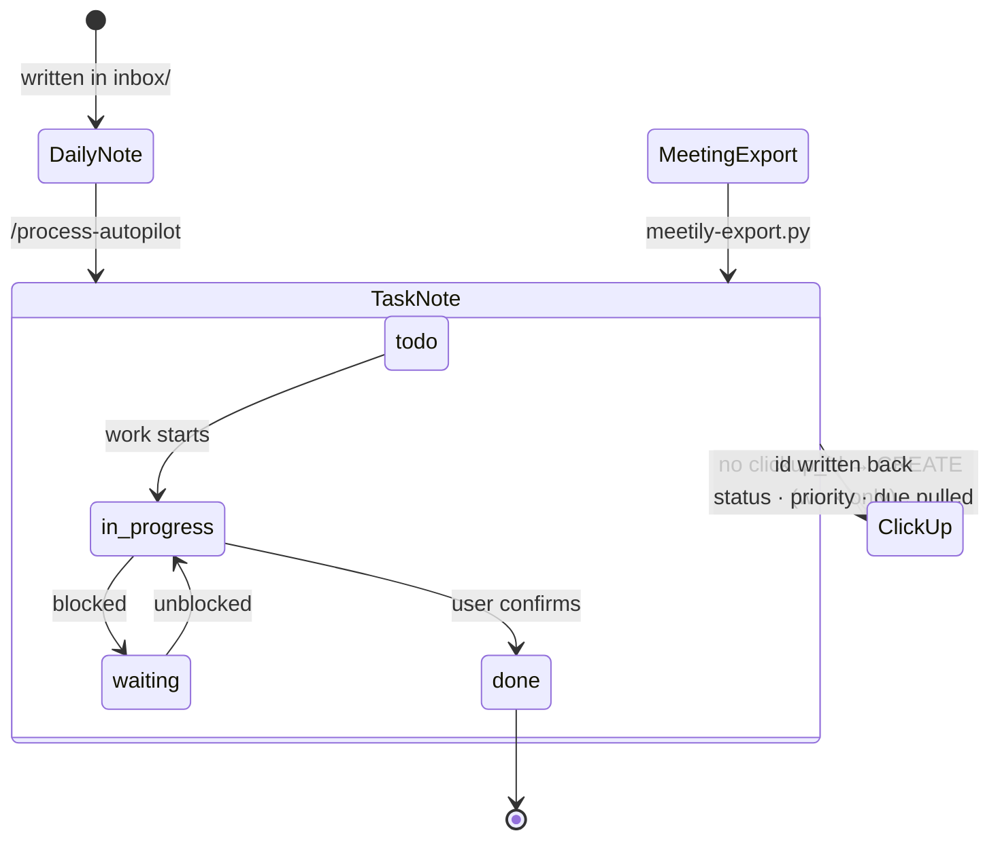
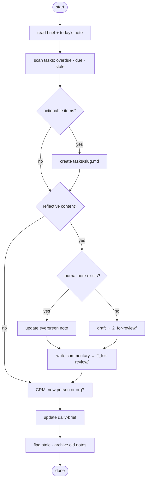
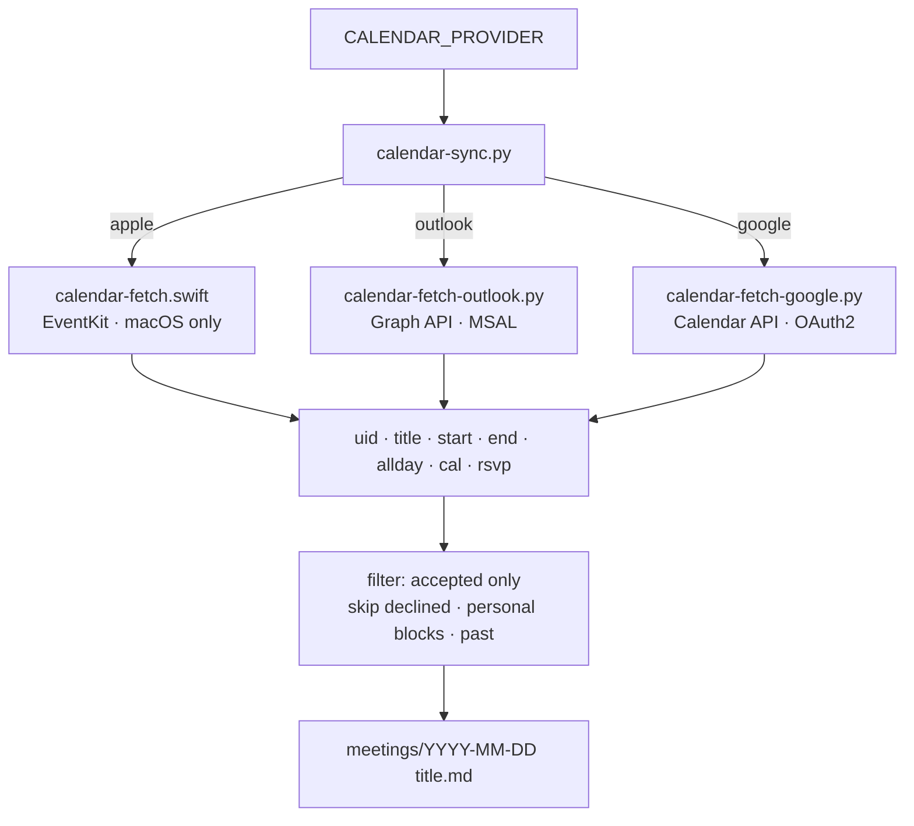

# giga-itu-workspace

Agent-powered workspace system for the ITU/Giga BCN tech team. Automates vault maintenance, syncs tools, and provides a shared set of PM skills accessible from the terminal or Claude desktop app.

---

## How it works

External services (calendar, meeting recordings, ClickUp) feed into two agents. The Housekeeper runs on a schedule and keeps the vault in sync automatically. The Product Manager agent provides interactive skills for PM work. Claude Code connects to the vault from the terminal, desktop app, or scheduled cloud triggers.



---

## Vault structure

The vault is an Obsidian folder. Each area has a specific role — Claude only writes to `0_daily-brief/` and `2_for-review/` unless processing daily notes.

```
vault/
├── 0_daily-brief/       ← Claude updates this
├── 1_inbox/             ← your daily notes
│   └── archive/
├── 2_for-review/        ← staging area
│   ├── stale/
│   └── not-urgent/
├── tasks/               ← front matter + ClickUp IDs
├── ideas/
├── meetings/
├── projects/
├── journal/
│   ├── personal/
│   └── strategy/
├── CRM/
│   ├── people/
│   └── companies/
├── content/
│   ├── ideas/
│   ├── drafts/
│   └── published/
├── weekly-reviews/
└── system/              ← config + agents
```

---

## Agents

### 🏠 Housekeeper

Runs automatically on weekdays. Three scripts fire on a schedule — no manual action needed.



Calendar sync supports Apple (macOS), Outlook, and Google — chosen at install time. Meetily export works on macOS, Linux, and Windows.

### 📦 Product Manager

Interactive skills invoked from a Claude Code session. All output stages to `2_for-review/` before filing.



---

## Task lifecycle

Tasks originate from daily notes (via `/process-autopilot`) or meeting exports (via Meetily). Once a work task note exists, ClickUp sync picks it up automatically via fswatch. A scheduled pull at 08:00 brings status, priority, and due date changes back from ClickUp. Personal tasks (tagged `personal`) are never synced.



---

## Daily processing (/process-autopilot)

Run this at the end of the day or step away and let it run unattended. It reads your daily note, extracts tasks, routes reflective content to journal, updates the daily brief, and flags anything needing your attention.



---

## Calendar provider dispatch

The calendar backend is selected at install time. All three providers output the same pipe-delimited format so the rest of the pipeline is identical.



---

## Model selection

Three tiers — Opus 4.7 only for genuinely complex planning. Scheduled agents auto-select between Haiku and Sonnet based on a complexity heuristic.

| Tier | Model | Use when |
|---|---|---|
| Complex planning | `claude-opus-4-7` | New system design, novel PRD, ambiguous strategy, multi-system changes |
| Standard execution | `claude-sonnet-4-6` | Drafting, synthesis, routing with judgement |
| Simple execution | `claude-haiku-4-5` | File ops, extraction, front matter updates |

| Agent / Skill | Default model | Why |
|---|---|---|
| `daily-assimilate` (quiet day) | Haiku | read/write only |
| `daily-assimilate` (system changed) | Sonnet | auto-detected: agent files modified today |
| `calendar-sync` | Python only | no Claude call |
| `meetily-export` | Python only | no Claude call |
| `clickup_sync` | Python only | no Claude call — push only |
| `clickup-pull` | Python only | no Claude call — scheduled pull |
| `/process-autopilot` | Sonnet (session) | routing + judgement calls |
| `/assimilate` | Sonnet (session) | pattern matching across session |
| PM Artefacts — standard | Sonnet (session) | drafting + synthesis |
| PM Artefacts — complex | Opus 4.7 (session) | new PRD / strategy — start with `--model claude-opus-4-7` |

Override `daily-assimilate` model via `DAILY_ASSIMILATE_MODEL` env var.

---

## Prerequisites

| Requirement | Notes |
|---|---|
| [Obsidian](https://obsidian.md) | Your vault |
| [Claude Code CLI](https://claude.ai/code) | `~/.local/bin/claude` |
| Python 3.9+ | `python3 --version` |
| Node.js | For Claude desktop MCP — `brew install node` |
| [fswatch](https://github.com/emcrisostomo/fswatch) | ClickUp sync file watcher — `brew install fswatch` |
| [Meetily](https://meetily.ai) | Optional |

---

## Setup

```bash
git clone https://github.com/oguzhanerr/giga-itu-workspace
cd giga-itu-workspace
python3 system/install.py
```

The installer walks through each component, asks which calendar provider you use, and writes `system/config.yaml` with your personal settings.

---

## Structure

```
system/
  install.py               → interactive installer
  requirements.txt         → Python dependencies
  agents/
    housekeeper/           → vault maintenance agent
    product-manager/       → PM skills + ClickUp sync
  utilities/               → one-off scripts
.claude/
  commands/                → slash commands available in Claude Code
```

---

## Platform support

| Feature | macOS | Linux | Windows |
|---|---|---|---|
| Daily assimilate | ✅ | ✅ | ✅ |
| Calendar sync (Apple) | ✅ | ❌ | ❌ |
| Calendar sync (Outlook/Google) | ✅ | ✅ | ✅ |
| Meetily export | ✅ | ✅ | ✅ |
| ClickUp sync | ✅ | ✅ | ⚠ WSL only |
| Claude desktop MCP | ✅ | ✅ | ✅ |

---

## Adding a new agent

1. Create `system/agents/<agent-name>/README.md` — document purpose, skills, and model selection
2. Add scripts under `system/agents/<agent-name>/`
3. Add slash commands to `.claude/commands/` if applicable
4. Register schedules via the installer or manually
5. Add a row to the Model Selection table above
